# 🛡️ Awesome Attack Surface Management (ASM & EASM)

[](https://github.com/ishandutta2007/Awesome-Attack-Surface-Management)

<p align="center">
  <a href="https://github.com/ishandutta2007/Awesome-Awesome-Awesome"></a><a href="https://discord.gg/jc4xtF58Ve"></a> <a href="https://github.com/ishandutta2007/Awesome-Attack-Surface-Management/stargazers"></a> <a href="https://github.com/ishandutta2007/Awesome-Attack-Surface-Management/blob/main/LICENSE"></a> <a href="https://github.com/ishandutta2007/Awesome-Attack-Surface-Management/pulls"></a> <a href="https://github.com/ishandutta2007"></a>
</p>

---

## 📌 Executive Overview & Core Concepts

**External Attack Surface Management (EASM)** and **Attack Surface Management (ASM)** represent the critical cybersecurity discipline of continuously discovering, mapping, monitoring, and inventorying an organization's digital footprint across external internet-facing assets. 

With enterprise environments rapidly expanding across multi-cloud infrastructure, SaaS environments, remote workplaces, and complex supply chain networks, unknown or unmanaged assets (**Shadow IT**, exposed databases, unpatched microservices, expired SSL certificates, and vulnerable APIs) account for over **80% of security breaches**.

This repository maintains a comprehensive, community-curated index of **commercial enterprise SaaS platforms** and **flagship open-source reconnaissance toolkits** designed for security engineers, SOC analysts, vulnerability managers, and bug bounty researchers.

---

## 📑 Table of Contents

- [🛡️ Executive Overview & Core Concepts](#️-executive-overview--core-concepts)
- [📊 Market Size & Sector Structure](#-market-size--sector-structure)
- [☁️ Enterprise SaaS & Hosted Platforms](#️-enterprise-saas--hosted-platforms)
- [🛠️ Open-Source GitHub Projects](#️-open-source-github-projects)
- [⚡ Recommended Architecture & Workflows](#-recommended-architecture--workflows)
- [🤝 How to Contribute](#-how-to-contribute)
- [💖 Support & Sponsoring](#-support--sponsoring)
- [⚖️ Disclaimer](#️-disclaimer)
- [📈 Star History](#-star-history)

---

## 📊 Market Size & Sector Structure

> 📈 **Sector Analysis**: The global **External Attack Surface Management (EASM)** market is estimated at **$1.8 Billion – $2.4 Billion (2026)**, expanding at a CAGR of **~24%**. The market is **moderately fragmented**, characterized by ongoing competition between major cloud/security hyperscalers (Microsoft, Palo Alto Networks, Wiz, Tenable) and specialized continuous discovery and threat intelligence platforms (Censys, Assetnote, UpGuard, Detectify), rather than a single "winner-take-all" vendor consolidation.

---

## ☁️ Enterprise SaaS & Hosted Platforms

The following SaaS platforms provide continuous global asset discovery, automated exposure monitoring, and analyst remediation workflows. 

*(Sorted by Company Size / Valuation in descending order)*

| 🏢 Company / Platform | 💰 Company Size (Valuation / Revenue) | 🏷️ Starting Tier Price | 🎁 Free Tier / Free Trial Limits | 🔍 Key ASM Capabilities |
| :--- | :--- | :--- | :--- | :--- |
| **[Microsoft Defender EASM](https://www.microsoft.com/en-us/security/business/threat-protection/external-attack-surface-management)** | ~$3.1 Trillion Market Cap / ~$245B Revenue | $0.01 / asset / day (~$3.65/asset/yr; ~$300/mo per 1k assets) | 30-day free trial supporting up to 500 assets | Passive global discovery, deep integration with Microsoft Sentinel & Security Copilot, automated risk scoring. |
| **[Palo Alto Networks Cortex Xpanse](https://www.paloaltonetworks.com/cortex/cortex-xpanse)** | ~$110 Billion Market Cap / ~$8.0B Revenue | ~$30,000 / year (starts at ~$2,500/mo for 250 assets) | 30-day interactive Cortex portal trial & 14-day guided PoC | Active global internet-wide scanning, shadow IT detection, automated playbook remediation. |
| **[Wiz EASM & Cloud Exposure](https://www.wiz.io/)** | ~$12 Billion Valuation / ~$500M ARR | ~$15,000 / year (core cloud security & exposure tier) | 14-day full feature free trial on AWS, Azure, or GCP environments | Agentless cloud asset graph, external exposure path mapping, multi-cloud attack path analysis. |
| **[Recorded Future ASI](https://www.recordedfuture.com/)** | ~$7.8 Billion Valuation / ~$300M ARR | ~$18,000 / year (as an intelligence add-on module) | 30-day Recorded Future Express free trial | Real-time threat intelligence correlation, third-party risk analysis, domain spoofing detection. |
| **[Tenable ASM](https://www.tenable.com/products/tenable-asm)** *(BitDiscovery)* | ~$5 Billion Market Cap / ~$860M Revenue | ~$3,000 / year ($6/asset/yr for 500 assets) | 30-day free trial monitoring up to 250 external assets | Domain & IP discovery, active web inventory, integration with Tenable Vulnerability Management. |
| **[Rapid7 Surface Command](https://www.rapid7.com/)** | ~$2.5 Billion Market Cap / ~$820M Revenue | ~$15,000 / year (up to 1,000 external assets) | 30-day free trial on the Rapid7 Insight Platform | Continuous asset discovery, exposure prioritization, seamless InsightVM integration. |
| **[Bugcrowd ASM](https://www.bugcrowd.com/)** | ~$500 Million Valuation / ~$75M Revenue | ~$12,000 / year (base subscription tier) | 14-day platform trial with sample asset graph visualization | Continuous discovery paired with crowdsourced penetration testing & bug bounty feedback loops. |
| **[Censys ASM & Search](https://censys.com/)** | ~$350 Million Valuation / ~$40M Revenue | $500 / month ($5,000/year for Censys Pro API / starter ASM) | Free forever tier (250 search queries/mo) + 14-day trial for Censys ASM | Global daily internet scanner, certificate transparency log monitoring, dynamic cloud discovery. |
| **[UpGuard BreachSight](https://www.upguard.com/)** | ~$250 Million Valuation / ~$30M Revenue | $5,249 / year (BreachSight Starter for up to 25 domains) | Free UpGuard Web Scanner (1 domain) + 7-day full enterprise trial | External attack surface scoring, vendor risk management, data leak & credential leak monitoring. |
| **[Assetnote](https://www.assetnote.io/)** | ~$150 Million Valuation / ~$15M Revenue | ~$20,000 / year (Continuous ASM starter for 500 assets) | 14-day guided proof-of-concept trial with domain audit | High-fidelity continuous discovery, tech stack fingerprinting, active security testing engine. |
| **[Detectify Surface Monitoring](https://detectify.com/)** | ~$100 Million Valuation / ~$20M Revenue | €600 / month (~$650/mo, ~$7,800/yr billed annually) | 14-day full feature free trial with unlimited domain scanning | Payload-based vulnerability detection, continuous subdomain monitoring, asset change alerts. |
| **[IONIX](https://www.ionix.io/)** *(Cyberpuku)* | ~$100 Million Valuation / ~$12M Revenue | ~$15,000 / year (starts at 500 continuous asset monitors) | 14-day free attack surface snapshot trial | Digital footprint & supply chain discovery, threat actor perspective scanning, zero-agent monitor. |
| **[Hadrian](https://hadrian.io/)** | ~$60 Million Valuation / ~$8M Revenue | €12,000 / year (~$13,000/yr for SMB starter scope) | 14-day automated risk report & exposure assessment trial | AI-driven autonomous penetration testing, continuous attack surface mapping, cloud asset discovery. |
| **[Shodan Enterprise](https://www.shodan.io/)** | ~$50 Million Valuation / ~$15M Revenue | $299 / month ($3,588/yr Small Business); Enterprise $1,099/mo | Free forever account (100 query results/mo + 1 host monitor) | World's first search engine for Internet-connected devices, ICS/SCADA monitoring, IP asset alerts. |

---

## 🛠️ Open-Source GitHub Projects

Open-source tools offer transparency, infinite customizability, and self-hosted privacy for security teams and researchers building in-house ASM capabilities.

*(Sorted by GitHub Stars_Count in descending order)*

1. ⚡ **[Nuclei](https://github.com/projectdiscovery/nuclei)** [](https://github.com/projectdiscovery/nuclei/stargazers)  
   *Fast, customizable vulnerability scanner based on simple YAML templates to detect exposures across web applications and infrastructure.*

2. 🚀 **[Masscan](https://github.com/robertdavidgraham/masscan)** [](https://github.com/robertdavidgraham/masscan/stargazers)  
   *Asynchronous TCP port scanner capable of scanning the entire Internet in under 6 minutes; foundational for high-speed port discovery.*

3. 🌐 **[OWASP Amass](https://github.com/owasp-amass/amass)** [](https://github.com/owasp-amass/amass/stargazers)  
   *Flagship open-source framework for in-depth attack surface mapping, external asset discovery, OSINT gathering, and asset graph storage.*

4. 🔍 **[Subfinder](https://github.com/projectdiscovery/subfinder)** [](https://github.com/projectdiscovery/subfinder/stargazers)  
   *Subdomain discovery tool that returns valid subdomains using passive online sources with exceptional speed and minimal overhead.*

5. 🗺️ **[Nmap](https://github.com/nmap/nmap)** [](https://github.com/nmap/nmap/stargazers)  
   *The industry-standard network exploration tool and security/port scanner relied upon by security teams worldwide.*

6. 🎯 **[Nikto](https://github.com/sullo/nikto)** [](https://github.com/sullo/nikto/stargazers)  
   *Web server scanner performing comprehensive tests against web servers for thousands of dangerous files, outdated versions, and misconfigurations.*

7. 🤖 **[BBOT](https://github.com/blacklanternsecurity/bbot)** [](https://github.com/blacklanternsecurity/bbot/stargazers)  
   *Recursive OSINT & attack surface scanning framework for comprehensive subdomain, IP, cloud asset, code leak, and email enumeration.*

8. 🌐 **[httpx](https://github.com/projectdiscovery/httpx)** [](https://github.com/projectdiscovery/httpx/stargazers)  
   *Fast and multi-purpose HTTP toolkit enabling probe execution, tech stack fingerprinting, title extraction, and HTTP status verification.*

9. 🎨 **[reNgine](https://github.com/yogeshojha/rengine)** [](https://github.com/yogeshojha/rengine/stargazers)  
   *Automated reconnaissance framework featuring a sleek web UI, continuous monitoring pipelines, database asset inventory, and alert notifications.*

10. 🔬 **[WhatWeb](https://github.com/urbanadventurer/WhatWeb)** [](https://github.com/urbanadventurer/WhatWeb/stargazers)  
    *Next-generation web scanner identifying web technologies, content management systems (CMS), embedded devices, and server configurations.*

11. 📊 **[Faraday](https://github.com/infobyte/faraday)** [](https://github.com/infobyte/faraday/stargazers)  
    *Open-source collaborative vulnerability management and recon aggregation platform that unifies results from dozens of scanners into one UI.*

12. ⚡ **[Naabu](https://github.com/projectdiscovery/naabu)** [](https://github.com/projectdiscovery/naabu/stargazers)  
    *Fast port scanner written in Go focused on speed, simplicity, and reliable host port enumeration.*

13. 📷 **[Aquatone](https://github.com/michenriksen/aquatone)** [](https://github.com/michenriksen/aquatone/stargazers)  
    *Tool for visual inspection of websites across discovered subdomains to quickly identify high-value visual targets.*

14. 🕵️ **[Recon-ng](https://github.com/lanmaster53/recon-ng)** [](https://github.com/lanmaster53/recon-ng/stargazers)  
    *Full-featured Web Reconnaissance framework written in Python with modular architecture, independent modules, and built-in database storage.*

15. 🕷️ **[Hakrawler](https://github.com/hakluke/hakrawler)** [](https://github.com/hakluke/hakrawler/stargazers)  
    *Simple, fast web crawler for discovering endpoints, JavaScript files, and hidden assets within web application attack surfaces.*

16. 📸 **[GoWitness](https://github.com/sensepost/gowitness)** [](https://github.com/sensepost/gowitness/stargazers)  
    *Go-based web screenshot utility using Chrome Headless to capture screenshot evidence of exposed web services and web applications.*

17. 🔓 **[Uncover](https://github.com/projectdiscovery/uncover)** [](https://github.com/projectdiscovery/uncover/stargazers)  
    *API wrapper tool for searching hosts across Censys, Shodan, ZoomEye, FOFA, Quake, and Hunter passive search engine APIs.*

---

## ⚡ Recommended Architecture & Workflows

Building a resilient, continuous open-source Attack Surface Management pipeline typically involves composable execution stages:

```
+------------------+     +-------------------+     +------------------+     +-------------------+
| Passive DNS & CT | --> | Active Resolution | --> | High-Speed Port  | --> | Vulnerability &   |
| (subfinder/Amass)|     | & Probing (httpx) |     | Scanning (naabu) |     | Scanning (nuclei) |
+------------------+     +-------------------+     +------------------+     +-------------------+
                                                                                      |
                                                                                      v
                                                                            +-------------------+
                                                                            | Dashboard / SOAR  |
                                                                            | (reNgine/Faraday) |
                                                                            +-------------------+
```

---

## 🤝 How to Contribute

Contributions are highly welcome! Please follow these guidelines:

1. Fork this repository.
2. Add your suggested entry to `README.md` in the appropriate table or list adhering to the existing structure.
3. Ensure all links point directly to official documentation or primary GitHub repositories.
4. Open a Pull Request with a short summary of the tool or platform.

---

## 💖 Support & Sponsoring

Thank you for using and exploring **Awesome Attack Surface Management**! If you find this curated list helpful for your security research, infrastructure discovery, or engineering workflows, please consider showing your support:

- ⭐ **Star** this repository to help others discover it.
- 🔄 **Fork** and contribute new SaaS platforms or open-source tools.
- 📢 **Share** this list with fellow security engineers, analysts, and red teams.
- ☕ **Sponsor / Buy Me a Coffee**: Support ongoing maintenance across open-source security lists via the [GitHub Sponsor Dashboard](https://github.com/sponsors/ishandutta2007).

---

## ⚖️ Disclaimer

- This list is strictly for educational, research, and defensive security engineering purposes.
- Always obtain explicit written authorization before conducting active scanning, port probing, or vulnerability assessments against third-party networks or domain assets.
- Open-source tools require self-hosted operations and careful scope configuration. Enterprise SaaS platforms shift continuous infrastructure management and scanning overhead to commercial vendors.

---

## 📈 Star History

[](https://star-history.dera.page/#ishandutta2007/Awesome-Attack-Surface-Management&type=date&legend=top-left)

---

<p align="center">
  <b>Maintained with ❤️ for Security Engineers, ASM Analysts, & Red Teams.</b>
</p>
